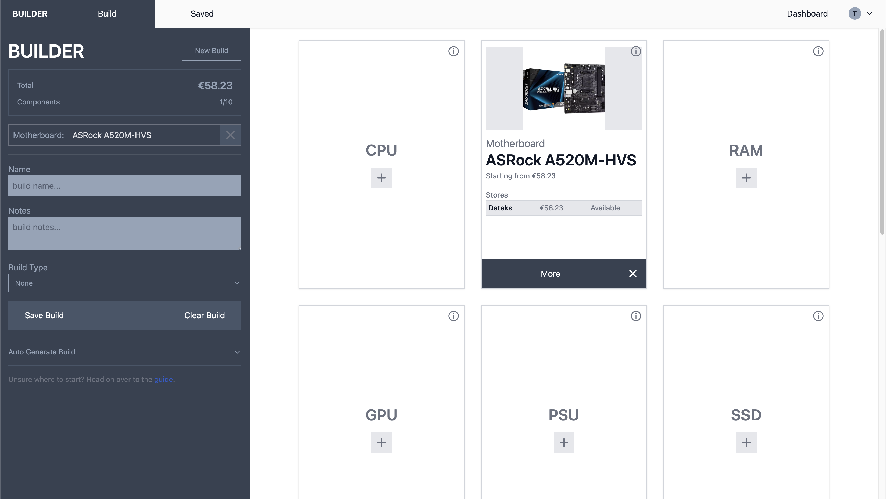
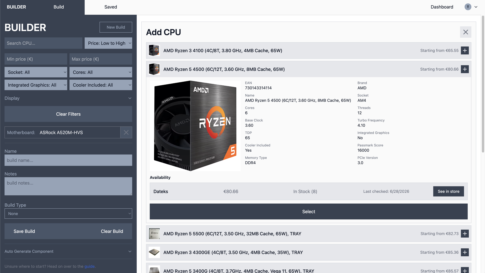
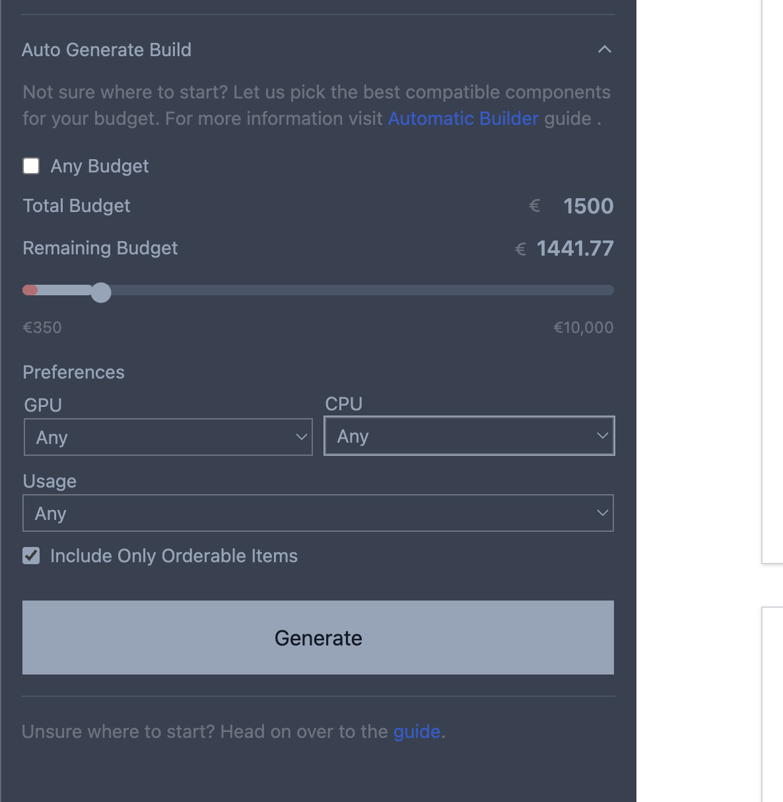
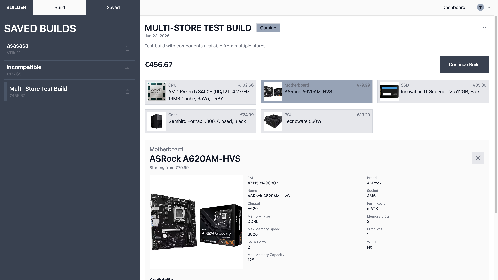
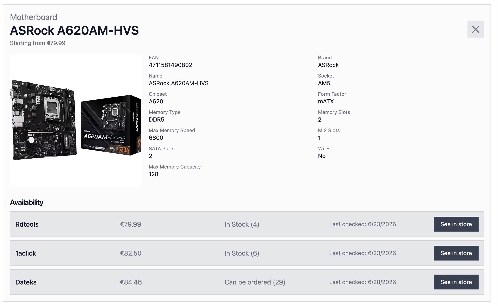

# PC Builder

PC Builder is a full-stack web app for creating and saving compatible custom PC builds. It combines a Laravel JSON API backend and a standalone React frontend.

## Features

- Guided PC build generator based on budget, build type, and CPU/GPU preferences.
- Manual component selection with compatibility-aware filtering, available to guests.
- Compatibility validation for CPU sockets, motherboard RAM type, GPU/case clearance, cooler/case clearance, cooler sockets, cooler TDP, motherboard/case form factor, and PSU wattage.
- Saved builds with notes, names, total price, and component relationships.
- User registration, login, email verification, and account settings.
- English and Latvian localization (i18next).

## Screenshots


_Builder Page_


_Component Selection_


_Incompatible Component Selection_


_Automatic Builder Section_


_Saved Page_


_Component Availability_

## Tech Stack

### Backend

- PHP 8.4
- Laravel 12
- Laravel Sanctum (session-based cookie auth)
- MySQL 8.4
- Pest / PHPUnit

### Frontend

- React 19
- React Router v7
- Vite 7
- Tailwind CSS 4
- Axios

## Repository Structure

```text
.
├── README.md
├── docker-compose.yml
├── backend/
│   ├── app/
│   │   ├── Http/Controllers/
│   │   ├── Models/
│   │   └── Services/
│   ├── database/
│   │   ├── migrations/
│   │   └── seeders/
│   ├── routes/
│   │   └── api.php
│   ├── tests/
│   ├── Dockerfile
│   └── composer.json
├── frontend/
│   ├── src/
│   │   ├── app.jsx
│   │   ├── Contexts/
│   │   ├── Layouts/
│   │   └── Pages/
│   ├── Dockerfile
│   ├── index.html
│   └── package.json
```

## Running With Docker

The easiest way to run the full stack is with Docker Compose.

Copy the backend environment file and fil in your values:

```bash
cp backend/.env.example backend/.env
```

The key values for Docker are already set correctly by default:

```env
DB_HOST=mysql
DB_DATABASE=pc_builder
DB_USERNAME=sail
DB_PASSWORD=password
SESSION_DOMAIN=localhost
SANCTUM_STATEFUL_DOMAINS=localhost,localhost:80
CACHE_STORE=file
```

Generate an app key if `.env` doesn't already have one:

```bash
docker compose run --rm backend php artisan key:generate
```

Start all services:

```bash
docker compose up -d
```

Run migrations:

```bash
docker compose exec backend php artisan migrate
```

| Service    | URL                   |
| ---------- | --------------------- |
| App        | http://localhost      |
| phpMyAdmin | http://localhost:8080 |

## Running Without Docker

### Backend

```bash
cd backend
cp .env.example .env
composer install
php artisan key:generate
php artisan migrate
php artisan serve
```

### Frontend

```bash
cd frontend
npm install
npm run dev
```

The Vite dev server proxies `/api` and `/sanctum` to `http://localhost:8000`, so the backend and frontend work together without any extra config.

The app is available at `http://localhost:5173`.

## Main Application Areas

### Builder

The builder lets users generate a complete build or fill individual component slots. Manual component selection is available to guests; auto-generation requires an account. The main services are:

- `BuilderService` - coordinates build generation, budget tiers, component allocations, warnings, and notes.
- `BuilderSlotPicker` - chooses compatible components for each slot.
- `CompatibilityService` - resolves selected component IDs, fetches compatible components, and validates full builds.
- `ComponentFilters` and `ComponentQueryFilter` - apply compatibility and UI filters to component queries.
- `ComponentScorer` - ranks component options during generation.

### Saved Builds

Users can save generated or manually assembled builds. A build stores a name, notes, type, total price, and references to selected component records.

## API Routes

### Auth

- `GET /sanctum/csrf-cookie` - fetch CSRF cookie
- `POST /api/register` - register
- `POST /api/login` - login
- `POST /api/logout` - logout
- `GET /api/user` - current authenticated user

### Components

- `GET /api/components/{type}` - list compatible components
- `GET /api/components/{type}/filters` - get filter options
- `GET /api/components/{type}/{id}` - get a single component

### Builder

- `GET /api/builder` - load an existing build into the builder
- `POST /api/builder` - generate a build
- `POST /api/builder/validate` - validate selected components
- `POST /api/builder/{type}` - generate one component slot

### Builds

- `GET /api/builds` - list saved builds
- `POST /api/builds` - save a build
- `GET /api/builds/{build}` - fetch a build
- `PATCH /api/builds/{build}` - update a build
- `DELETE /api/builds/{build}` - delete a build

### Users

- `PATCH /api/users/{user}` - update user
- `DELETE /api/users/{user}` - delete user

## Compatibility Rules (In Progress)

Compatibility checks are handled in Laravel. Current checks include:

- CPU socket must match motherboard socket.
- Motherboard memory type must match RAM memory type.
- GPU length must fit inside the selected case.
- CPU cooler height must fit inside the selected case.
- CPU cooler socket support must include the selected CPU socket.
- CPU cooler TDP support must be sufficient for the CPU.
- Motherboard form factor must fit the selected case.
- PSU wattage must satisfy CPU/GPU demand and GPU minimum PSU recommendations.

## Testing

Tests live in `backend/tests/Feature/BuilderApiTest.php` and cover build generation response structure, budget tiers, build-type rules, CPU/GPU preferences, compatibility expectations, and warnings.

Tests require a database with component data. Run with:

```bash
cd backend
./vendor/bin/pest
```

## Development Notes

- Component prices, stock status, and stock quantity come from Dateks listing pages.
- Detailed specs come from Dateks product pages.
- The frontend is localized in English and Latvian via i18next, with translation files under `frontend/src/locales/`.
