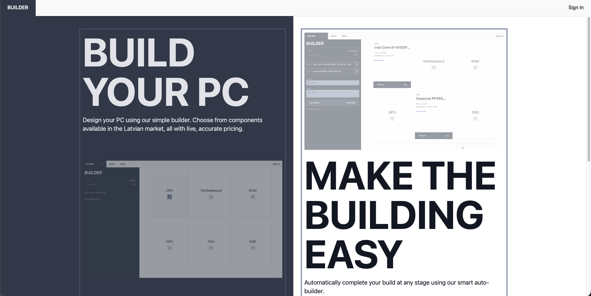
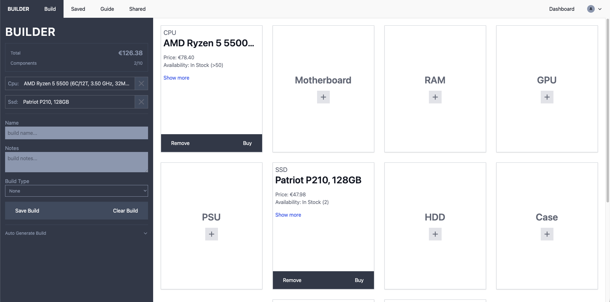
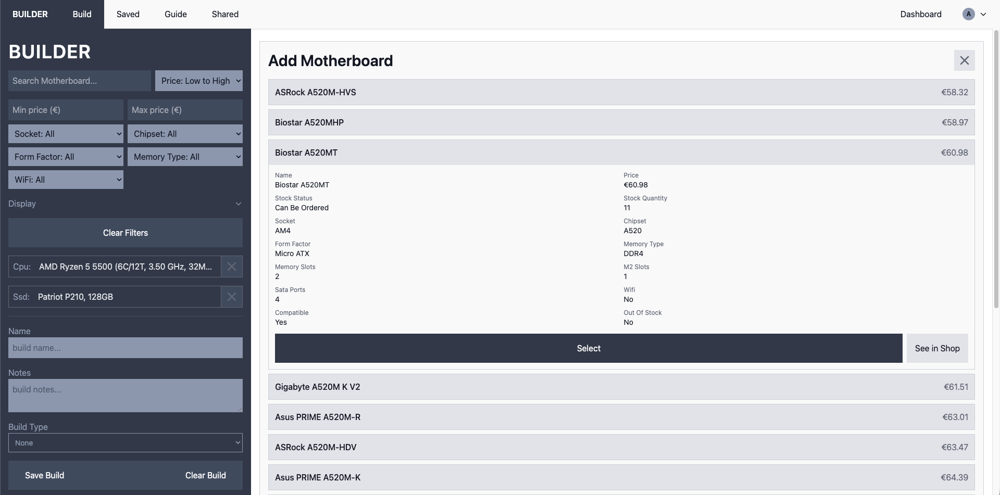
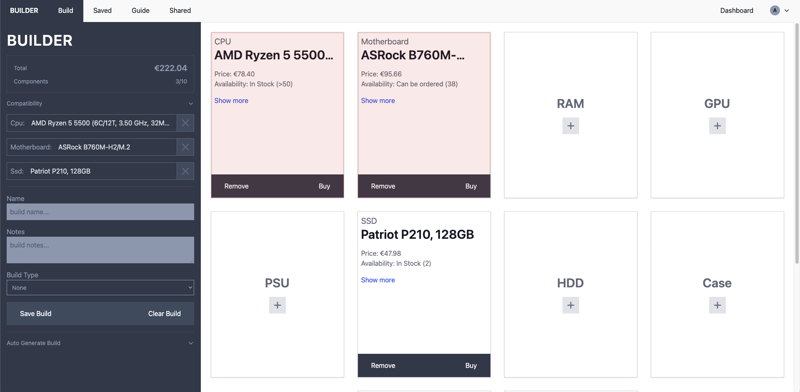
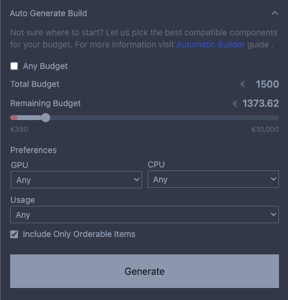
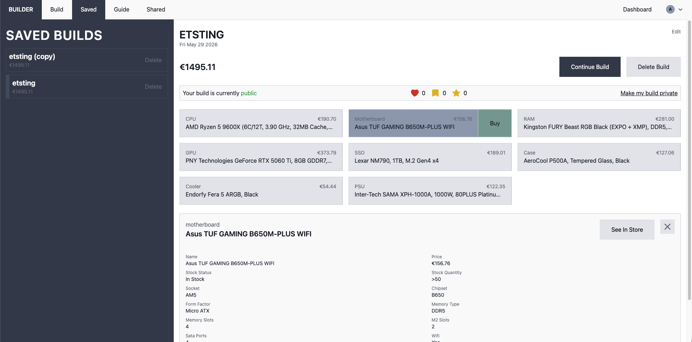
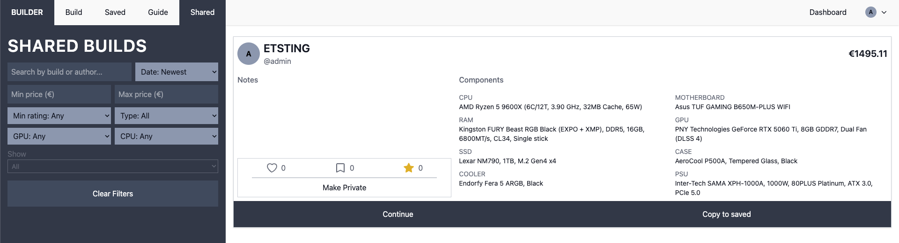
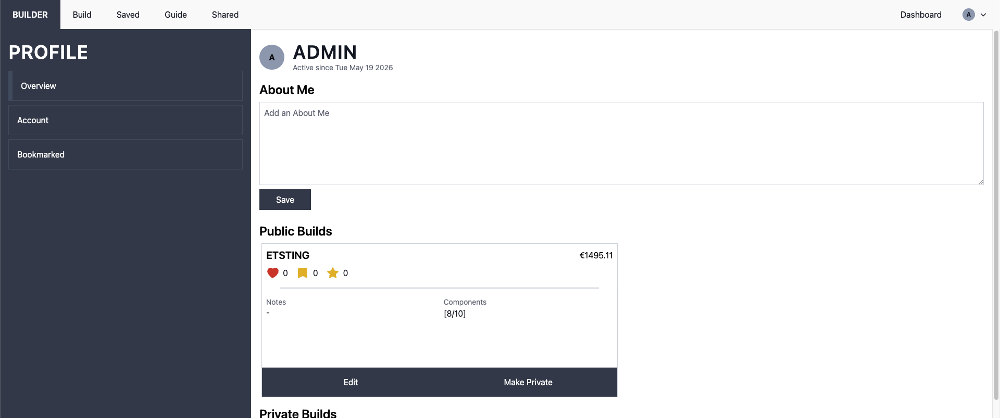
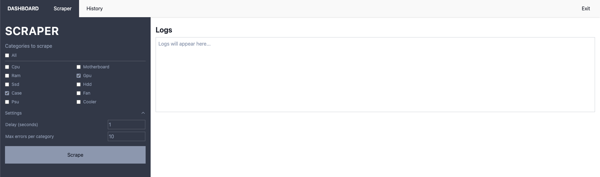
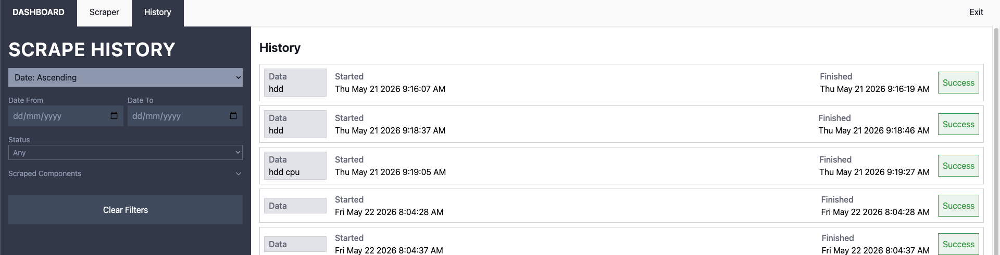

# PC Builder

PC Builder is a full-stack web app for creating, saving, sharing, and reviewing compatible custom PC builds. It combines a Laravel backend, an Inertia + React frontend, and a Python scraper that imports live component data from Dateks into MySQL.

The project is split into two main parts:

- `website/` - the Laravel application, React pages, API routes, compatibility logic, admin tools, database migrations, and tests.
- `scraper/` - the Python scraper service that collects component listings and specifications, parses them by category, and writes them into the same database used by the app.

There is also a detailed scraper reference in `pc_builder_scraper_guide.md`.

## Features

- Guided PC build generator based on budget, build type, and CPU/GPU preferences.
- Manual component selection with compatibility-aware filtering.
- Compatibility validation for CPU sockets, motherboard RAM type, GPU/case clearance, cooler/case clearance, cooler sockets, cooler TDP, motherboard/case form factor, and PSU wattage.
- Saved builds with notes, names, total price, visibility controls, and component relationships.
- Shared public builds with search, sorting, filtering, likes, bookmarks, and star reviews.
- User registration, login, profile pages, public profiles, and account management.
- Admin dashboard for running scraper jobs and viewing scrape history.
- Python scraper for CPUs, motherboards, RAM, GPUs, SSDs, HDDs, cases, fans, PSUs, and coolers.

## Screenshots


_Home Screen_


_Builder Page_


_Component Selection_


_Incompatible Component Selection_


_Automatic Builder Section_


_Saved Page_


_Shared Build Page_


_Profile Page_


_Scraper Page_


_Scrape History Page_

## Tech Stack

### Web App

- PHP 8.4
- Laravel 12
- Laravel Sanctum
- Inertia Laravel
- React 19
- Vite 7
- Tailwind CSS 4
- MySQL 8.4
- Pest / PHPUnit
- Laravel Sail

### Scraper

- Python 3
- Flask
- Requests
- BeautifulSoup
- mysql-connector-python
- python-dotenv

## Repository Structure

```text
.
├── README.md
├── pc_builder_scraper_guide.md
├── scraper/
│   ├── main.py
│   ├── server.py
│   ├── config.py
│   ├── database.py
│   ├── parsers/
│   └── scrapers/
└── website/
    ├── app/
    │   ├── Http/Controllers/
    │   ├── Models/
    │   └── Services/
    ├── database/
    │   ├── migrations/
    │   └── seeders/
    ├── resources/
    │   ├── css/
    │   ├── js/
    │   └── views/
    ├── routes/
    ├── tests/
    ├── compose.yaml
    ├── composer.json
    └── package.json
```

## Main Application Areas

### Builder

The builder lets users generate a complete build or fill individual component slots. The main services are:

- `BuilderService` - coordinates build generation, budget tiers, component allocations, warnings, and notes.
- `BuilderSlotPicker` - chooses compatible components for each slot.
- `CompatibilityService` - resolves selected component IDs, fetches compatible components, and validates full builds.
- `ComponentFilters` and `ComponentQueryFilter` - apply compatibility and UI filters to component queries.
- `ComponentScorer` - ranks component options during generation.

Supported component types are:

```text
cpu, motherboard, ram, gpu, ssd, hdd, case, cooler, psu, fan
```

### Saved Builds

Users can save generated or manually assembled builds. A build can store a name, notes, type, total price, public/private status, and references to selected component records.

### Shared Builds

Public builds can be browsed through the shared page. Users can filter by price, type, CPU/GPU preference, rating, liked builds, bookmarked builds, and personal builds. Shared builds support likes, bookmarks, and one rating per user.

### Admin Scraper

Admin users can start scraper runs from the app. The Laravel app streams logs from the Python scraper service, then stores scrape session metadata and category-level results.

## Local Setup With Laravel Sail

From the project root:

```bash
cd website
cp .env.example .env
composer install
npm install
```

Make sure the database values in `website/.env` match the Sail MySQL service. A typical Sail setup is:

```env
DB_CONNECTION=mysql
DB_HOST=mysql
DB_PORT=3306
DB_DATABASE=website
DB_USERNAME=sail
DB_PASSWORD=password
```

Then start the containers:

```bash
./vendor/bin/sail up -d
```

Prepare the Laravel app:

```bash
./vendor/bin/sail artisan key:generate
./vendor/bin/sail artisan migrate
```

Run the frontend dev server:

```bash
./vendor/bin/sail npm run dev
```

The app is available at:

```text
http://localhost
```

phpMyAdmin is available at:

```text
http://localhost:8080
```

The scraper service is exposed at:

```text
http://localhost:5000
```

## Local Setup Without Sail

From `website/`:

```bash
cp .env.example .env
composer install
npm install
php artisan key:generate
php artisan migrate
```

Run the backend and frontend in separate terminals:

```bash
php artisan serve
npm run dev
```

For this mode, use your local MySQL connection values in `website/.env`, usually with `DB_HOST=127.0.0.1`.

## Scraper Usage

The scraper can run in two ways.

### Through Docker Compose

The `website/compose.yaml` file defines a `scraper` service. It shares `website/.env` with the scraper container, so the scraper writes into the same database as Laravel.

Once you have an account made with role `admin`, you can head over to Dashboard and scrape by using the user interface.

### Directly From `scraper/`

```bash
cd scraper
python3 -m venv .venv
source .venv/bin/activate
pip install -r requirements.txt
cp .env.example .env
python3 main.py
```

The scraper currently supports these categories:

```text
cpu, motherboard, ram, gpu, ssd, hdd, case, fan, psu, cooler
```

Each category maps to one or more Dateks listing URLs, a parser module, and a database table in `scraper/config.py`.

## Important Routes

### Web Routes

- `/` - home page
- `/guide` - guide page
- `/register` and `/login` - authentication pages
- `/builder` - PC builder
- `/builds` - saved builds
- `/shared` - shared public builds
- `/profile` - current user profile
- `/profile/account` - account settings
- `/profile/bookmarked` - bookmarked builds
- `/profile/{user}` - public user profile
- `/admin` - admin dashboard
- `/admin/scrape` - scraper runner
- `/admin/history` - scraper history

### API Routes

Authenticated API routes include:

- `GET /api/components/{type}` - list compatible components
- `GET /api/components/{type}/filters` - get filter options
- `GET /api/components/{type}/{id}` - get a component
- `POST /api/builder` - generate a build
- `POST /api/builder/validate` - validate selected components
- `POST /api/builder/{type}` - generate one component slot
- `POST /api/builds` - save a build
- `GET /api/builds/{build}` - fetch a build
- `PATCH /api/builds/{build}` - update a build
- `DELETE /api/builds/{build}` - delete a build
- `PATCH /api/builds/{build}/publish` - toggle public visibility
- `GET /api/shared` - fetch public builds
- `POST /api/shared/{build}/like` - toggle like
- `POST /api/shared/{build}/bookmark` - toggle bookmark
- `POST /api/shared/{build}/review` - create or update rating
- `PATCH /api/users/{user}` - update user
- `DELETE /api/users/{user}` - delete user

Admin-only API routes include:

- `POST /api/scrape` - store scrape session results
- `GET /api/scrape/history` - fetch scrape history

## Data Model Overview

The application has separate tables and Eloquent models for each component type:

- `Cpu`
- `Motherboard`
- `Ram`
- `Gpu`
- `Ssd`
- `Hdd`
- `PcCase`
- `Cooler`
- `Psu`
- `Fan`

Build-related models:

- `Build`
- `BuildLike`
- `BuildBookmark`
- `BuildReview`

Scraper history models:

- `ScrapeSession`
- `ScrapeResult`

The scraper uses `dateks_id` as the stable external identifier for imported components, and saved builds reference components through those IDs.

## Compatibility Rules

Compatibility checks are handled in Laravel rather than in SQL. Current checks include:

- CPU socket must match motherboard socket.
- Motherboard memory type must match RAM memory type.
- GPU length must fit inside the selected case.
- CPU cooler height must fit inside the selected case.
- CPU cooler socket support must include the selected CPU socket.
- CPU cooler TDP support must be sufficient for the CPU.
- Motherboard form factor must fit the selected case.
- PSU wattage must satisfy CPU/GPU demand and GPU minimum PSU recommendations.

Some component categories, such as SSDs, HDDs, and fans, currently have fewer compatibility rules.

## Testing Notes

The main automated coverage is in `website/tests/Feature/BuilderApiTest.php`. It checks build generation response structure, budget tiers, build-type rules, CPU/GPU preferences, compatibility expectations, and warnings.

Because these tests depend on component records, they need a database containing suitable scraped component data.

Run tests with Sail:

```bash
./vendor/bin/sail bin pest
```

## Development Notes

- The scraper intentionally extracts only fields needed for display or compatibility matching.
- Component prices, stock status, and stock quantity come from Dateks listing pages.
- Detailed specs come from Dateks product pages.
- Admin scraper logs are streamed from the Python Flask service through Laravel to the browser.
- The project uses admin role middleware for scraper and history pages.
